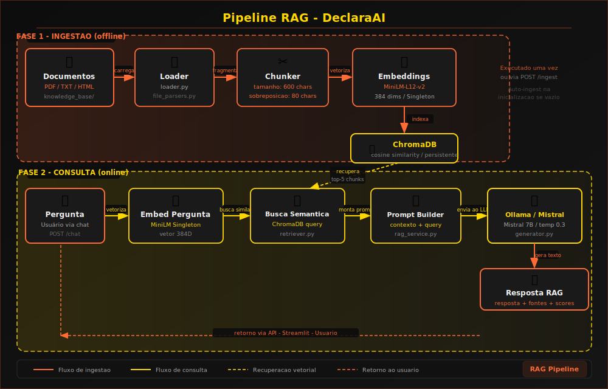
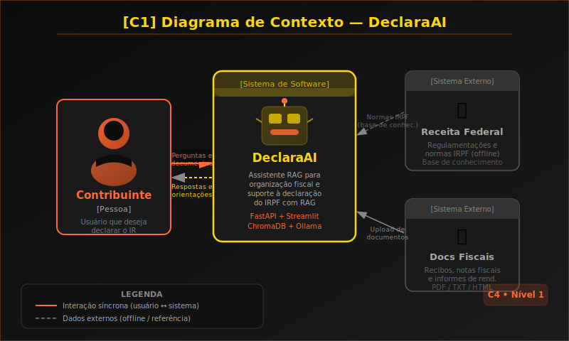
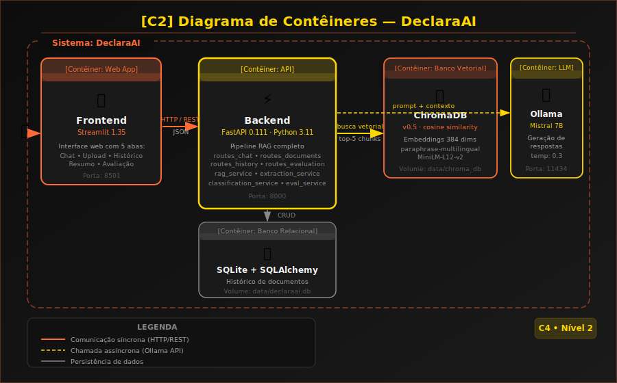

<p align="center">
  
</p>

<p align="center">
  Assistente inteligente com <strong>RAG</strong> para organização de documentos e apoio à declaração do imposto de renda pessoa física.<br>
  <em>Projeto Acadêmico — UEA • Oficina e Desenvolvimento de Sistemas I</em>
</p>

---

<h2 align="center">🤖 Tecnologias Utilizadas</h2>

<p align="center">
  
  
  
  
  
  
  
  
</p>

---

<h2 align="center">📝 Descrição do Projeto</h2>

O **DeclaraAI** é um Micro SaaS com pipeline **RAG (Retrieval-Augmented Generation)** que auxilia usuários leigos na organização de documentos fiscais e na compreensão do processo de declaração do IRPF. O sistema processa documentos enviados (recibos, notas fiscais, informes), classifica-os automaticamente por categoria tributária e responde dúvidas com base em uma base de conhecimento estruturada.

---

<h2 align="center">🎯 Funcionalidades</h2>

| Funcionalidade | Descrição |
|---|---|
| **Chat RAG** | Perguntas em linguagem natural respondidas com base na base de conhecimento tributário |
| **Upload de documentos** | Processamento de PDF, TXT e HTML com extração automática de dados |
| **Classificação tributária** | Categorização inteligente por tipo de documento fiscal (8 categorias) |
| **Histórico** | Armazenamento e consulta com filtros por categoria, nome e período |
| **Resumo anual** | Organização por categoria para facilitar o preenchimento da declaração |
| **Avaliação RAG** | Métricas quantitativas de qualidade da recuperação e das respostas |

---

<h2 align="center">🧠 Pipeline RAG</h2>

<p align="center">
  
</p>

### Decisões Técnicas Justificadas

| Decisão | Justificativa |
|---|---|
| **chunk_size = 600 chars** | Suficiente para capturar contexto fiscal completo sem diluir relevância semântica |
| **overlap = 80 chars** | Preserva frases e valores monetários cortados na fronteira entre chunks |
| **paraphrase-multilingual-MiniLM-L12-v2** | Suporte nativo ao português, 384 dims, leve para CPU, bom desempenho em similaridade |
| **cosine similarity** | Mais robusta para documentos de comprimentos variados vs. distância euclidiana |
| **Mistral 7B via Ollama** | Multilíngue, excelente em tarefas factuais/técnicas, open-source (Apache 2.0), auto-hospedado |
| **temperatura = 0.3** | Respostas conservadoras e precisas, domínio fiscal exige mínimo de alucinação |
| **Singleton embeddings** | Evita recarregar o modelo (~110 MB) a cada requisição |
| **SQLite** | Zero configuração, suficiente para protótipo sem dados distribuídos |

---

<h2 align="center">🔍 Justificativa do Modelo LLM</h2>

**Mistral 7B** foi escolhido para o DeclaraAI pelos seguintes motivos:

1. **Domínio fiscal e português**: o Mistral 7B apresenta desempenho sólido em tarefas de compreensão e geração em português, idioma do domínio da aplicação.
2. **Factualidade**: modelos de instrução como o Mistral tendem a seguir o contexto fornecido no prompt com menor taxa de alucinação que modelos maiores sem RAG.
3. **Auto-hospedado via Ollama**: elimina dependência de APIs externas, garantindo privacidade dos documentos fiscais do usuário.
4. **Licença aberta**: Apache 2.0, permite uso acadêmico e comercial sem restrições.
5. **Eficiência**: 7B parâmetros rodam em CPU (4 a 8 GB RAM), viabilizando execução em hardware comum.

**Alternativas consideradas:**
- `llama3`: maior qualidade mas requer mais RAM
- `phi3`: muito pequeno para contextos fiscais longos
- APIs externas (OpenAI, Anthropic): não open-source, dependência de conectividade

---

<h2 align="center">📁 Estrutura do Projeto</h2>

```
DeclaraAI/
├── backend/
│   ├── app/
│   │   ├── main.py                       # FastAPI app + lifespan (auto-ingest)
│   │   ├── api/
│   │   │   ├── routes_chat.py            # POST /chat, POST /ingest, GET /status
│   │   │   ├── routes_documents.py       # POST /documents/upload, /save
│   │   │   ├── routes_history.py         # GET /history, /history/summary
│   │   │   └── routes_evaluation.py      # POST /evaluation/recuperacao, /completa
│   │   ├── core/
│   │   │   ├── config.py                 # Configuracoes via pydantic-settings
│   │   │   └── database.py               # SQLAlchemy + SQLite
│   │   ├── models/document.py            # ORM: tabela documentos
│   │   ├── schemas/document.py           # Schemas Pydantic (request/response)
│   │   ├── services/
│   │   │   ├── extraction_service.py     # Extracao de texto e metadados (regex)
│   │   │   ├── classification_service.py # Classificacao tributaria (8 categorias)
│   │   │   ├── history_service.py        # CRUD historico + resumo anual
│   │   │   ├── rag_service.py            # Orquestrador do pipeline RAG
│   │   │   └── evaluation_service.py     # Metricas de avaliacao do pipeline
│   │   ├── rag/
│   │   │   ├── loader.py                 # Carregamento de documentos
│   │   │   ├── chunker.py                # Fragmentacao 600 chars / overlap 80
│   │   │   ├── embeddings.py             # Singleton paraphrase-multilingual-MiniLM
│   │   │   ├── vector_store.py           # ChromaDB (cosine similarity)
│   │   │   ├── retriever.py              # Busca semantica + estrutura re-ranking
│   │   │   └── generator.py              # Geracao de resposta via Ollama
│   │   └── utils/file_parsers.py         # Parsers PDF/TXT/HTML
│   ├── requirements.txt
│   └── Dockerfile
├── frontend/
│   ├── app.py                            # Streamlit: 5 abas (laranja/preto)
│   ├── .streamlit/config.toml            # Tema: laranja, preto, branco
│   ├── requirements.txt
│   └── Dockerfile
├── data/
│   ├── uploads/                          # Documentos enviados pelos usuarios
│   ├── knowledge_base/
│   │   └── guia_imposto_renda.txt        # Base de conhecimento IRPF incluida
│   └── chroma_db/                        # Banco vetorial persistente
├── docs/
│   └── diagrams/
│       ├── logo.svg                      # Logo do sistema (leao + IA)
│       ├── pipeline_rag.svg              # Diagrama do pipeline RAG
│       ├── c4_contexto.svg               # Diagrama C4 - Contexto
│       └── c4_containers.svg             # Diagrama C4 - Conteineres
├── Makefile                              # Comandos de gerenciamento da stack
├── docker-compose.yml
├── .env.example
└── README.md
```

---

<h2 align="center">🐳 Como Executar com Docker</h2>

### 1. Clonar o repositório

```bash
git clone https://github.com/JulianaBallin/DeclaraAI.git
cd DeclaraAI
```

### 2. Subir os containers

```bash
# Com Docker Compose diretamente
docker compose up -d --build

# Ou usando o Makefile
make up-build
```

> **Primeira execução:** aguarde o download das imagens e instalação das dependências (~5 min).

### 3. Baixar o modelo LLM no Ollama

```bash
# Diretamente
docker exec -it declaraai-ollama ollama pull mistral

# Ou usando o Makefile
make modelo
```

> O download do Mistral 7B (~4 GB) pode levar alguns minutos dependendo da conexão.

### 4. Acessar a aplicação

| Serviço | URL |
|---|---|
| Interface Streamlit | http://localhost:8501 |
| API FastAPI (Swagger) | http://localhost:8000/docs |
| Ollama | http://localhost:11434 |

---

<h2 align="center">🛠️ Gerenciamento com Makefile</h2>

O projeto inclui um `Makefile` com atalhos para todas as operações comuns:

### Ciclo da Stack

```bash
make up             # sobe todos os servicos em background
make up-build       # reconstroi imagens e sobe os servicos
make down           # para e remove containers
make down-v         # para containers e remove volumes
make restart        # reinicia todos os servicos
make restart-backend   # reinicia apenas o backend
make restart-frontend  # reinicia apenas o frontend
make restart-ollama    # reinicia apenas o Ollama
```

### Diagnostico e Logs

```bash
make ps             # lista containers em execucao
make logs           # acompanha logs de todos os servicos
make logs-backend   # logs do backend
make logs-frontend  # logs do frontend
make logs-ollama    # logs do Ollama
make health         # checa o endpoint raiz da API
make status         # exibe metricas do pipeline RAG
```

### Modelo e Ingestao

```bash
make modelo         # baixa o Mistral 7B no Ollama
make ingest         # re-indexa a base de conhecimento via API
```

### Qualidade de Codigo

```bash
make lint           # verifica com flake8
make format         # formata com black e isort
make check          # verifica formatacao sem alterar arquivos
make test           # executa testes com pytest
make test-cov       # testes com relatorio de cobertura
make clean          # remove cache Python
```

```bash
make help           # lista todos os comandos disponiveis
```

---

<h2 align="center">🖥️ Como Executar Localmente (sem Docker)</h2>

### Pre-requisitos
- Python 3.11+
- [Ollama](https://ollama.ai) instalado

### Backend

```bash
cd backend
python -m venv .venv
source .venv/bin/activate        # Linux/Mac
# .venv\Scripts\activate         # Windows

pip install -r requirements.txt

# Configurar variaveis
cp ../.env.example ../.env
# Edite: OLLAMA_BASE_URL=http://localhost:11434

uvicorn app.main:app --reload --host 0.0.0.0 --port 8000
```

### Frontend

```bash
cd frontend
pip install -r requirements.txt
export API_URL=http://localhost:8000
streamlit run app.py
```

### Ollama

```bash
ollama serve          # Terminal 1
ollama pull mistral   # Terminal 2
```

---

<h2 align="center">🔌 API REST</h2>

A documentacao interativa completa esta disponivel em `http://localhost:8000/docs` (Swagger UI).

### Chat RAG

| Metodo | Endpoint | Descricao |
|---|---|---|
| `POST` | `/chat` | Enviar pergunta ao assistente |
| `POST` | `/ingest` | Re-indexar base de conhecimento |
| `GET` | `/status` | Status e metricas do sistema RAG |

### Documentos

| Metodo | Endpoint | Descricao |
|---|---|---|
| `POST` | `/documents/upload` | Upload e processamento de documento |
| `POST` | `/documents/save` | Salvar documento no historico |
| `GET` | `/documents/categorias` | Listar categorias tributarias |

### Historico

| Metodo | Endpoint | Descricao |
|---|---|---|
| `GET` | `/history` | Listar historico (filtros: categoria, nome, periodo) |
| `GET` | `/history/summary` | Resumo anual por categoria |
| `DELETE` | `/history/{id}` | Excluir documento do historico |

### Avaliacao

| Metodo | Endpoint | Descricao |
|---|---|---|
| `POST` | `/evaluation/recuperacao` | Avaliar etapa de recuperacao (sem LLM) |
| `POST` | `/evaluation/completa` | Avaliar pipeline completo (com LLM) |
| `GET` | `/evaluation/casos-teste` | Listar casos de teste |

### Exemplos de uso

```bash
# Chat
curl -X POST http://localhost:8000/chat \
  -H "Content-Type: application/json" \
  -d '{"pergunta": "Quais despesas medicas posso deduzir no IR?"}'

# Upload
curl -X POST http://localhost:8000/documents/upload \
  -F "arquivo=@recibo.pdf"

# Avaliacao de recuperacao
curl -X POST http://localhost:8000/evaluation/recuperacao

# Ou com Makefile
make ingest
make status
```

---

<h2 align="center">📊 Avaliacao da Solucao</h2>

O sistema implementa metricas quantitativas inspiradas no **RAGAS** (Es et al., 2023), adaptadas para execucao autossuficiente sem LLM-juiz externo.

### Metricas implementadas

| Metrica | Descricao | Endpoint |
|---|---|---|
| **Taxa de Recuperacao** | % de perguntas com ao menos 1 chunk recuperado | `/evaluation/recuperacao` |
| **Score Medio de Contexto** | Similaridade cosseno media (ChromaDB) dos chunks retornados | `/evaluation/recuperacao` |
| **Cobertura de Keywords** | % de termos esperados encontrados na resposta gerada | `/evaluation/completa` |
| **Analise de Falhas** | Casos com cobertura abaixo de 50%, indica lacunas na base | ambos |

### Casos de teste

8 perguntas sobre o dominio IRPF cobrindo:
obrigatoriedade, deducoes medicas, deducoes educacionais, modalidades de declaracao,
previdencia privada, penalidades, autonomos (carne-leao) e dependentes.

### Como avaliar

```bash
# Avaliacao rapida de recuperacao (nao requer Ollama)
curl -X POST http://localhost:8000/evaluation/recuperacao

# Avaliacao completa com LLM
curl -X POST http://localhost:8000/evaluation/completa
```

Ou use a aba **Avaliacao** na interface Streamlit.

---

<h2 align="center">🧩 Modelagem C4</h2>

O projeto segue o modelo **C4** para representacao arquitetural:

### C1 - Contexto

<p align="center">
  
</p>

### C2 - Conteineres

<p align="center">
  
</p>

- **C1 - Contexto:** usuario interage com DeclaraAI via browser
- **C2 - Conteineres:** Frontend (Streamlit), Backend (FastAPI), Banco Vetorial (ChromaDB), Banco Relacional (SQLite), LLM (Ollama)
- **C3 - Componentes:** pipeline RAG (loader, chunker, embeddings, retriever, generator), servicos de classificacao e extracao, API REST

---

<h2 align="center">⚠️ Limitacoes</h2>

- Nao substitui contador ou validacao oficial da Receita Federal
- A qualidade das respostas depende do modelo Ollama configurado
- Extracao de metadados por heuristicas pode falhar em documentos nao padronizados
- Base de conhecimento deve ser atualizada manualmente com novas regras fiscais
- PDFs baseados em imagem (scan) nao tem texto extraivel sem OCR

---

<h2 align="center">👥 Equipe</h2>

<p align="center">

| Nome | Matricula |
|---|---|
| Juliana Ballin Lima | 2315310011 |
| Fernando Luiz Da Silva Freire | 2315310007 |

</p>

---

<h3 align="center">UEA • Oficina e Desenvolvimento de Sistemas I • DeclaraAI</h3>
